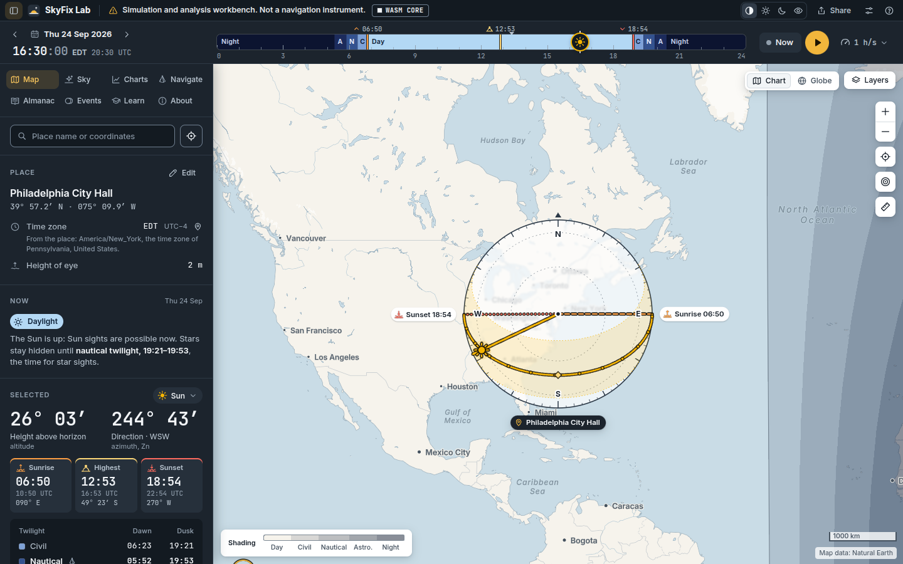
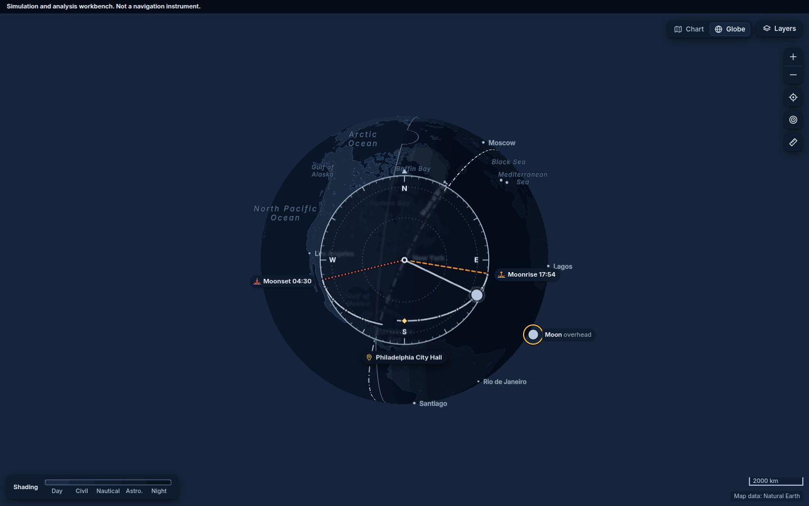
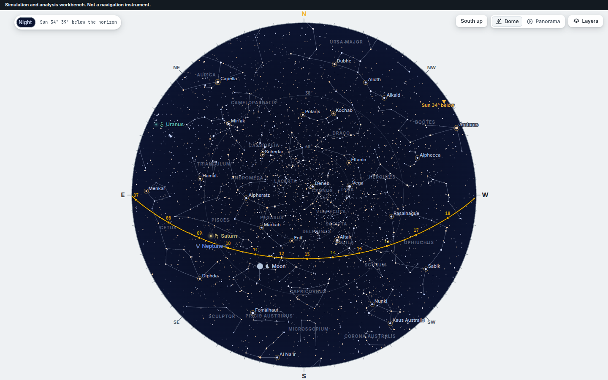
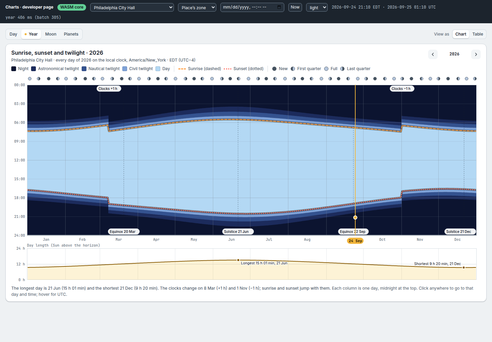
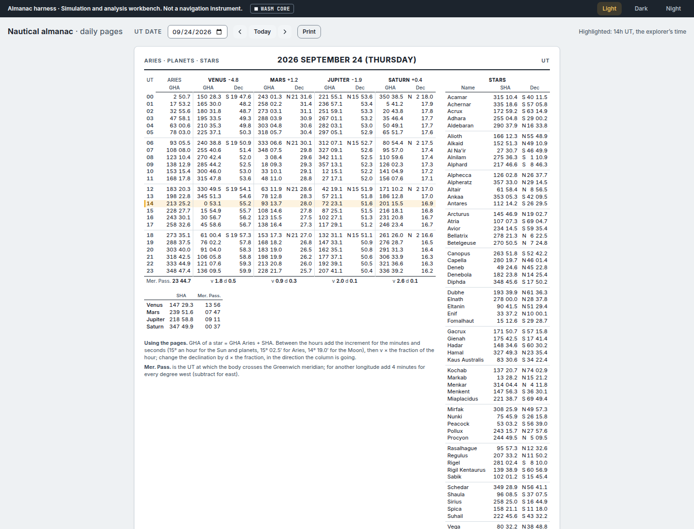
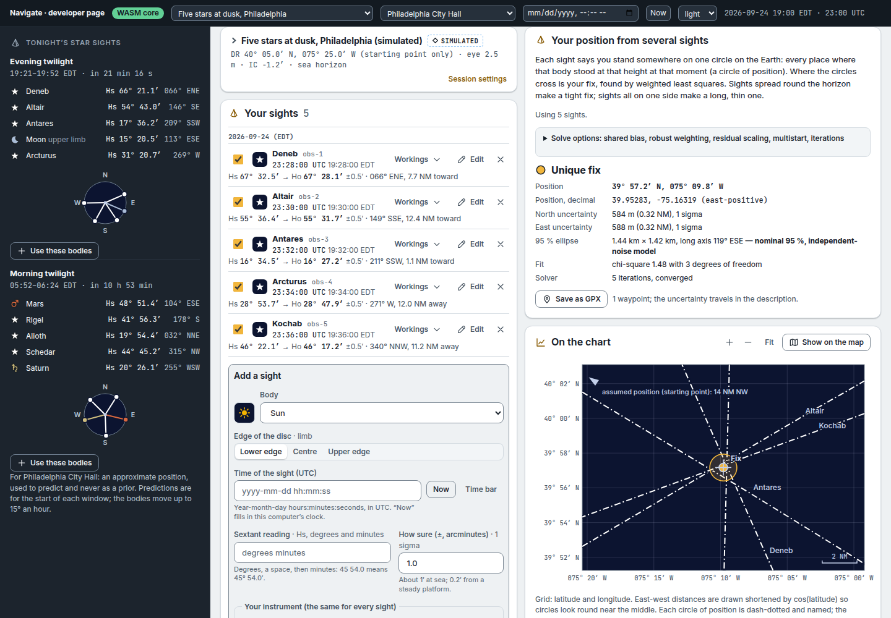
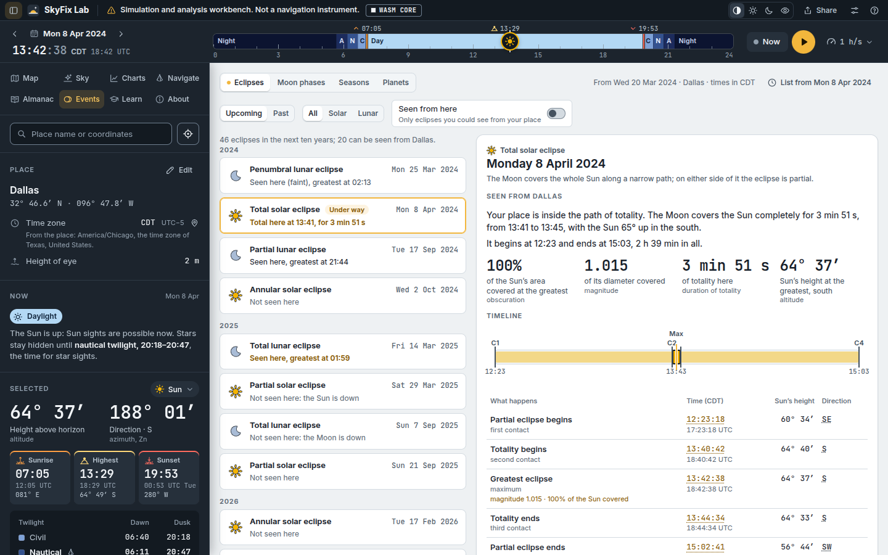
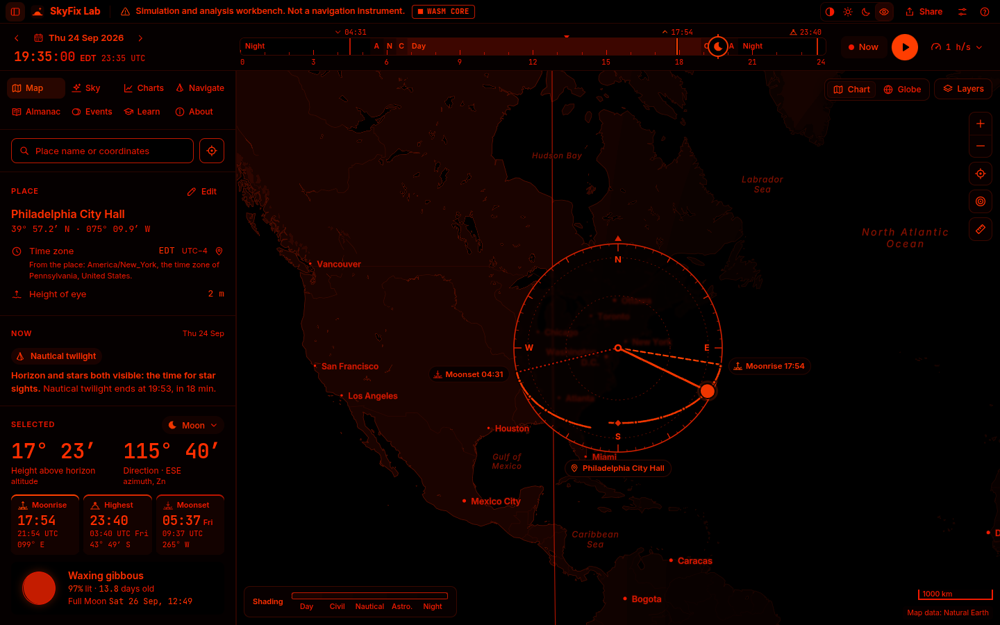
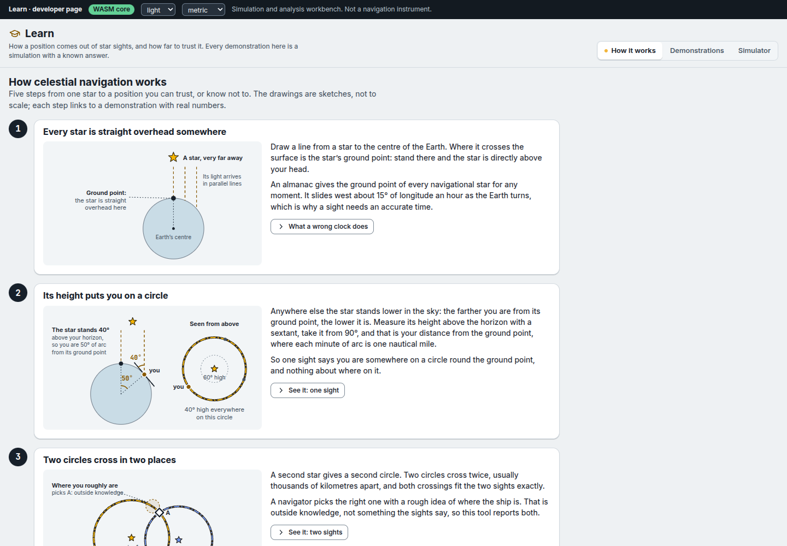

# Using the explorer

The explorer is the map-first way to use SkyFix Lab: pick a place, pick a moment, and see
where the Sun, the Moon, the planets and the navigational stars are from there — how high,
in which direction, and when each one rises and sets. It is the site's home page,
<https://holdthedoorhoid.github.io/skyfix-lab/>. Nothing the original workbench could do is
gone: the [Navigate](#navigate) view below now does everything it did (sights,
corrections, the fix, the planner) and more, and [Learn](#celestial-navigation-in-five-minutes)
has its simulator and demonstrations. The original workbench itself was retired in
September 2026; its old address, `/classic/`, now opens the explorer instead — its
Observations, Corrections, Fix and Planner links on Navigate, its Simulator link on
Learn — online or offline. Links to the explorer's old address, `/next/`, share links
included, still work too: they open the home page with the same place and time.

**Simulation and analysis workbench. Not a navigation instrument.** Every position and
time on the page comes from the same offline calculation engine as the command line
(`skyfix`, [Command line](CLI.md)), compiled to run inside your browser. Numerical
agreement with reference data is not field accuracy — see
[Accuracy and limitations](ACCURACY.md).

On your first visit a short tour — five cards beside the parts they explain: the place,
the time bar, the views, the Tonight tab, and what the numbers are — points the way. It
never blocks the page; skip it, or close it, and it stays closed on that device. **Show the
tour** in the **?** Help menu, or on the About view, brings it back.

## Setting a place

The explorer always has one place selected. Four ways to change it, all in the search box
at the top of the side panel or the map itself:

- **Click the map** (press and hold, on a touchscreen). Click again to fine-tune.
- **Type a place name** into the search box — "Manila", "Cape Horn" — and choose from the
  list. Place names come from an offline gazetteer of about 7,300 towns and cities
  ([Third-party sources](THIRD_PARTY.md), "Basemap and gazetteer"), so this works with no
  connection.
- **Type coordinates** into the same box — `39 57.2 N 75 09.9 W`, or plain decimal degrees
  `39.9526, -75.1652` both work. The box accepts the usual forms a navigator or a chart
  would use.
- **"Use my location"**, the target-shaped button beside the search box. Your browser will
  ask permission first. The position it finds is used only in this page — it is never
  saved and never sent anywhere (see [Sharing a link](#sharing-a-link) below for the one
  exception, which you control).

Press **Edit** at the top of the Place panel for exact entry: coordinates, an optional
name, the time zone, and your **height of eye** — how high above the sea your own eyes
are, which sets the dip of the horizon for sights and for rise/set times if you turn on
"dipped" horizon in Settings.

A place's **time zone** normally follows the place (guessed from where it is, with the
reason shown underneath). Press the pin beside the time zone to keep your own choice —
UTC, "nautical zone time" (the whole-hour zone a vessel at sea would keep), or a specific
zone — even as you move the place around.

## Moving through time

The ribbon across the top of the page is the explorer's clock. It is coloured by the
Sun's phase at your place — night, the three twilights (astronomical, nautical, civil)
and day — with rise, highest point and set marked for whichever body is selected below.
Drag the handle, or use any of these:

- **The day arrows** beside the date step one calendar day at a time.
- **The date**, clicked, opens a calendar for picking any day directly. Under the month
  there is a **year field** for any year — type `1066`, or `585` with **BC** chosen beside
  it (or `585 BC`, or `−584`) and press **Go** — and buttons that move the time by 10, 100
  or 1000 years either way, keeping the day and the time of day.
- **The clock**, clicked, lets you type a time of day.
- **Now** jumps to the current moment and starts following the real clock (a small dot
  shows it is "live"); moving the time by hand turns this off again.
- **Play** runs time forward (or backward — there is a direction switch beside the speed)
  at a chosen speed, from real time up to ten years per second:

  | speed |  | speed |
  |---|---|---|
  | Real time | | 1 day per second |
  | 1 minute per second | | 1 week per second |
  | 10 minutes per second | | 1 month per second |
  | 1 hour per second | | 1 year per second |
  | 6 hours per second | | 10 years per second |

  Faster than about a week per second the rising and setting times and the ribbon's
  colours are left out while time runs (they would change every frame); they come back
  the moment you pause or slow down.

Along the top edge of the ribbon a thin strip marks the Sun's **golden hour** (the Sun
between 6° above and 4° below the horizon: warm, low light) and **blue hour** (4° to 6°
below: a deep blue sky); hover over it for the times.

**Far from today.** The explorer is built for 2000 BC to AD 3000 (how much of that your
copy covers is in About), and the time bar says what changes as you go back or forward:

- **Dates** before 15 October 1582 are in the **Julian calendar**, as people then wrote
  them, marked *Julian* beside the date; Thursday 4 October 1582 was followed by Friday
  15 October. Years before AD 1 are written "585 BC" (astronomers call that year −584).
  Settings can show the Gregorian calendar carried back instead, and years in the
  astronomers' or ISO style.
- **The clock** beside your local time is **UTC** from 1972 to 2035 and **UT** (Universal
  Time, the time scale of the almanacs) outside those years: UTC did not exist before
  1972, and leap seconds are to end in 2035.
- **Before 1850** the local clock is **local mean time** (LMT) at your place's longitude —
  the Sun's time there, which clocks kept before time zones — unless you pinned a zone.
- **A ± chip** such as `±12 min` beside the clock means the Earth's rotation at that date is
  known only that well, so every clock time carries that uncertainty (the positions of the
  bodies among the stars do not). It appears when the uncertainty passes 30 seconds —
  before about AD 700 and after about 2100 — and always on estimated years.
- **Outside the checked years** a message says so: dates the core does not cover show
  nothing, with the years it does cover; years only estimated (with the optional Deep time
  data pack) say *Historical estimate* or *Far-future estimate*, and sights are offered only
  in the checked years.

**Keyboard shortcuts**, usable anywhere on the page (they are also listed under the
**?** Help button in the top bar):

| keys | what it does |
|---|---|
| `←` / `→` | 10 minutes back or on |
| `Shift` + `←` / `→` | 1 hour |
| `Alt` + `←` / `→` | 1 day |
| `Page Up` / `Page Down` | 1 month (with `Shift`, 1 year) |
| `Ctrl` + `Page Up` / `Page Down` | 100 years (with `Shift`, 1000 years); browsers with tabs may keep these keys for themselves, so the calendar's ±100 and ±1000 buttons do the same |
| `Space` | play or pause |
| `N` | now: follow the clock |
| `Esc` | close a menu |

## The selected body

The panel's **Selected** card gives the chosen body's height above the horizon and its
direction in large type, and its rise, highest point and set for the pass it is on. For
the Sun it adds the twilight times, the length of the day, and the length of the shadow of
an object of any height you type. **When is it at…?**, for any body, lists the times on the
day shown when it passes a height you type — 30°, say, or −6° for the Sun at the end of
civil twilight — and pressing one moves the clock there. **Navigator's details** add the
GHA, the declination, and Hc and Zn as sight-reduction tables give them: seen from the
Earth's centre, with no refraction or parallax, so for the Moon they differ from its height
above your horizon by up to a degree.

## The views

The tabs along the top of the side panel (or, on a phone, along the top of the bottom
sheet — see below) switch between eight views: Map, Sky, Tonight, Charts, Navigate,
Almanac, Events and Learn. The place, the time and the selected body are shared across all
of them. [About](#about) has no tab: it opens from the **?** Help menu.

### Map and Globe

The home view: a full offline world map (public-domain Natural Earth data — see
[Third-party sources](THIRD_PARTY.md)) with an optional online street-map layer you can
switch on in Layers. At your place, a compass dial shows the horizon, where the selected
body rises, sets and is right now, and its path across the sky on its current pass —
from its rise through its highest point to its set, the same pass the panel's Selected
card shows (so the Moon's "Moonset 05:37 Fri" is the same on both; a time on another day
carries its weekday). The solstice band shows the Sun's extreme paths at midsummer and
midwinter. Day, night and the three twilights are
shaded across the whole map, along with the ground point of each body — the spot on Earth
directly beneath it — and, for the selected body, the circle you would get by measuring
its height with a sextant right now. **Chart** and **Globe** (top right) switch between a
flat map and a spinning globe of the same data; a ruler tool measures a distance and
bearing between two points. What other views draw on the map — Navigate's fix, an eclipse
from Events, a Learn demonstration — is listed at the bottom of **Layers**, each with a
**Remove** button; while such a drawing is on the map, the compass dial turns see-through
so the fix under it stays readable.

### Sky

What you would actually see, looking up: a **Dome** (the whole sky at once, zenith in the
middle) or a **Panorama** (drag to turn toward any compass point, scroll to zoom), with
roughly 9,000 stars sized by brightness and tinted by colour, the 88 constellation
figures, the planets, the Moon with its correct phase, and the sky's own colour following
the Sun. A **South up** switch flips the dome for the southern hemisphere. The star field
is for display only — see [Third-party sources](THIRD_PARTY.md), "Star field and
constellations" — and never affects a fix.

### Tonight

One page for the night at your place, for anyone going out to look: when it gets dark,
the Moon, the planets, the best deep-sky objects, meteor showers, the Milky Way, the next
two weeks' events, the nearest tide station and the photographers' golden and blue hours.

**Which night.** A night runs from one local noon to the next (noon by the Sun at your
longitude, as the deep-sky engine counts it). The page shows the night the explorer's time
belongs to: in the afternoon and evening, the night ahead; after midnight, the night still
going on while it is dark, and the coming one as soon as its darkness is over — at
astronomical dawn, when the Sun climbs back above 18° below the horizon. Where the Sun
never gets that low (summer at high latitudes) the switch comes when the darkest stretch
ends, with no darkness at all at sunrise, and in the midnight sun at local midnight.
(The deep-sky engine on its own switches at sunrise; the page chooses the night itself and
asks the engine about that night.) **◀ ▶** step a night — they move the explorer's time,
so every other view follows — and **Tonight** comes back to the real night, following the
clock. The heading says "Tonight", "Tomorrow night" or "Last night" against the real date,
and "The night of" otherwise.

- **The summary** under the date says it in sentences: "Clear-sky darkness 20:25–05:21
  (8 h 56 min). The Moon, a day before full (97% lit), sets at 05:37. Planets: Mars and
  Jupiter in the morning; Saturn from 20:21." An eclipse seen from your place is named
  with what you would see of it (a partial solar eclipse "7% of the Sun covered here").
  "Clear-sky" because the weather is not known here.
- **The night** is a bar from an hour before sunset to an hour after sunrise: the sky's
  twilight bands, golden and blue hour, when the Moon is up, when the Milky Way's core is
  10° or more up in full darkness, and the moonless darkness best for faint objects.
  Click anywhere on it to move the explorer's time there; **Every moment of the night**
  lists sunset, each twilight, moonrise and moonset, the core's best moment and the rest
  as times you can press (the way to use the bar from the keyboard).
- **Moon**: its phase drawn as it looks from your place (south up south of the equator),
  how much of it is lit and how far from the nearest quarter, its rise and set, its
  distance, the moonless part of the darkness, a note when the nearest new or full Moon is
  a supermoon or a micromoon, and, while it is up at night, the named craters and ranges
  best seen along the line between lunar day and night. **See it up close** opens the Sky
  view on it.
- **Planets**: each planet 10° or more up while the Sun is 6° down, where to look and
  when — "Jupiter, east, rises 22:10, highest 03:40 at 61°, magnitude −2.7" — with the
  moments of Jupiter's moons you can watch (a moon passing behind the planet or into its
  shadow) and how far Saturn's rings are open. Press one to see it in the Sky view.
- **Deep sky**: the eight best-placed clusters, nebulae and galaxies tonight, then eight
  more at a time, each with its type, brightness, constellation, best time and height,
  what to see it with (naked eye, binoculars, a small telescope, a camera), a line about
  it and how much the Moon washes it out. **Your sky** sets how dark your sky is, from a
  dark site (Bortle 1) to a city centre (Bortle 9), and the ranking follows; it is kept
  while the page is open. **Show in Sky** opens the Sky view at the object's best moment.
- **Meteor showers** active tonight: the rate you might see under your sky (an estimate:
  the shower's ZHR, cut by the radiant's height and by the faint meteors your sky and the
  Moon hide), the best time, where the radiant is, and whether the Moon is up then.
- **Milky Way**: when the core is up in full darkness, its best moment and where the arch
  of the Milky Way runs across the sky then. **Plan a photo** goes to that moment.
- **Coming up**: the next fourteen days — Moon phases (and supermoons), the Moon at its
  closest and farthest, eclipses and what your place sees of them, the Moon and planets
  passing close to each other or to bright stars (the moment they are best seen from your
  place), the Moon hiding a star or a planet, meteor-shower peaks, oppositions, a planet
  standing still before or after its backward loop, equinoxes and solstices, the Earth
  closest to or farthest from the Sun, transits of Mercury and Venus. Press one to open
  Events at that moment.
- **Tides**: where a NOAA tide station may be within 100 nautical miles, the nearest
  station's high and low water through the night — predicted, not observed. The stations
  come in the optional US tides data pack; the card offers it with its size, and nothing
  is downloaded unless you ask (see [Working offline](#working-offline)). **Tides chart**
  opens the station's curve in Charts.
- **Photography**: golden hour and blue hour this evening and tomorrow morning.

**Print** makes a one-page sheet of the night (the explanations and buttons stay on the
screen). Every time on the page is on your display clock with UTC in its tooltip; for dates
whose clock time is uncertain (far in the past or future) the ± chip beside a time says by
how much. Rankings, meteor rates and limiting magnitudes are estimates from stated rules,
and the page says so where it shows them.

### Charts

Six tabs of charts, each also available as a plain table (**View as** → **Table**, top
right), and each with a **Save** menu (see [Saving, printing and sharing a
chart](#saving-printing-and-sharing-a-chart) below). The place and the time are the
explorer's own: clicking a time or a day on any chart moves the whole explorer there.

- **Day**: the height of each body through the day, over the twilight bands.
- **Year**: sunrise, sunset and twilight for every day of the year, with the Moon's phase
  along the top.
- **Sun**: five charts of the Sun, chosen from the second row of tabs.
  - **Sun path**: the Sun's path across the sky today, with its hours marked, between its
    paths on the June and December solstices and at the equinoxes; every day's path lies
    between the two solstices. **From above** shows the sky dome as a map does, north up,
    the zenith in the middle and the horizon round the edge; **Along the horizon** shows
    bearing across and height up, as you see it facing the equator. Sunrise and sunset are
    marked with their times; click the path to go to that moment.
  - **Analemma**: where the Sun stands at one clock time — 12:00 unless you choose another
    — on every day of the year: the figure-8 a camera fixed to one spot would record.
    **Local mean time** is the clock of your longitude (at 12:00 the figure sits on the
    meridian); **Zone time** is your zone's standard time all year, what a watch without
    daylight saving reads. The first of each month is marked, and the explorer's date.
  - **Sunrise bearings**: where on the horizon the Sun rises and sets on every day of the
    year (north up in both panels), and how high it stands at solar noon.
  - **Equation of time**: how far a sundial runs ahead of or behind the clock through the
    year (up to about 16 minutes either way), and how far north or south of the equator
    the Sun is overhead (its declination). The navigator knows both from the almanac.
  - **Solar panel**: a **clear-sky estimate** of the sunlight reaching a panel, day by day
    through the year and hour by hour on the explorer's day, for a tilt and a direction
    you choose (it starts tilted at your latitude, facing the equator). It gives the year's
    total, the same on flat ground, and the tilt that would collect the most, with a
    button to use it. Clouds are not modelled, nor haze, snow, shading, dirt, heat or the
    panel's own efficiency: the numbers are the ceiling on a clear day, not a forecast, and
    the page says so beside every one, with the model's typical error.
- **Moon**: **Phases** is a monthly calendar with each day's Moon, moonrise and moonset,
  and the days the Moon is **nearest** (perigee) and **farthest** (apogee), with the
  distance; supermoons and micromoons are marked on their full Moons. **Through the
  year** shows how high the Moon stands, and in which direction, at one hour of the
  evening (21:00 unless you choose another) on every day of the year: it comes back to
  the same part of the sky only about once a month.
- **Planets**: when each planet is up in the dark, through the year.
- **Tides**: predicted high and low water and the tide curve for the day or the week at
  the US tide station nearest your place, or another of the twelve nearest, with the
  explorer's time as a moving cursor and night shown along the bottom. Heights are above a
  datum you choose — mean lower low water (MLLW, the chart datum of US charts) unless you
  choose another the station has. **Show on the map** marks the station on the map; a link
  opens NOAA's own page for it. Tides are **predictions, not observations**: weather,
  surge and river flow are not included, and the page says so. They come from NOAA's
  harmonic constants for its 3 499 US stations, an optional data pack of 0.34 MB that the
  tab offers to download the first time (see [Working offline](#working-offline)); some
  stations give only high and low water, and the curve between is then an estimate,
  drawn dashed. Predictions are offered for 1900 to 2100.

#### Saving, printing and sharing a chart

Every chart's **Save** menu offers:

- **Save picture (PNG)**: the chart as you see it, always in the light colours so it
  prints and reads anywhere, with a caption underneath saying what it shows, for where and
  when, what the numbers are and how far to trust them.
- **Save table (CSV)**: the chart's Table view as a spreadsheet file. Angles are decimal
  degrees and heights plain numbers (the column headings give the units); the first lines,
  starting with `#`, say what the file is.
- **Print**: this chart alone, as wide as the page (across the page when the chart is wide).
- **Share picture…**, on phones and tablets that have a share sheet.

Files are made in your browser and saved or shared only when you choose; nothing is sent
anywhere.

### Almanac

Daily pages laid out the way a printed nautical almanac's are: GHA and declination for
Aries, the Sun, the Moon and the four navigational planets at every hour, the 57
navigational stars plus Polaris, meridian passages, and the rise/set/twilight table across
31 standard latitudes. Step a day at a time or jump to **Today**; **Print** produces a
clean printable page. This is the same computation as `skyfix almanac` on the command
line ([Command line](CLI.md)) and is normative in
[Accuracy and limitations](ACCURACY.md), "Almanac pages".

### Navigate

Where you actually work out a position, the way the whole project is really about. Enter
sights body-first — pick the body, which edge of the disc you brought to the horizon, the
time, the sextant reading and how sure you are — and every correction (index error, dip,
refraction, semidiameter, parallax) is worked out live beside it, never hidden. Seven
methods, each explained in plain words as you open it:

| method | what it gives you |
|---|---|
| **Fix** | your position from several sights, by weighted least squares, with the honest 95 % ellipse, conditioning and every result kind (unique, ambiguous, underdetermined, failed) |
| **Noon sight** | latitude from a body's highest point, and a weak longitude from when it happened |
| **Polaris** | latitude from the Pole Star, with the Nautical Almanac's a0/a1/a2 shown beside the rigorous answer |
| **Running fix** | sights taken on the move, brought to one instant along your course and speed |
| **Average a run** | several quick sights of one body turned into one good one |
| **Lunar distance** | Greenwich time — and so longitude — from the angle between the Moon and another body, with no chronometer |
| **Plan sights** | tonight's evening and morning twilight windows, which bodies to shoot and in what order, predicted readings included |

The Fix's chart has a **Fit map** switch: it shades every nearby position by how well it
fits your sights — darker is worse — with the 95 % and 3-sigma lines drawn on it and a
caption saying what the shading can and cannot show (a biased sextant or a wrong clock
moves the whole picture without widening it). It is off to start; with it on, **Show on
the map** takes those lines to the map too.

The fix (and the circles of position behind it) draws directly on the Map view. Sessions
save automatically **in this browser only** — nothing is kept until you enter a sight, and
nothing is ever sent anywhere or written into the address bar — and you can import or
export a session as JSON or CSV, or save a fix as a GPX waypoint. A handful of worked
examples are built in if you want to see a method with real numbers before typing your
own. This view now does everything the original workbench did, and more.

### Events

Eclipses, Moon phases, equinoxes and solstices, and the planets' big moments, as lists
you can click.

- **Eclipses** — every solar and lunar eclipse of the next (or last) ten years, with a
  switch for "seen from here". Pick one to read, in plain words, what you would see from
  your place: whether you are inside the path of totality, when it starts and ends, how
  much of the Sun is covered, and how high it stands. **Show on the map** draws the path
  of totality (or annularity), its central line and the limits of the partial eclipse;
  **Go there** moves your place and time to the point of greatest eclipse. Solar eclipse
  cards carry an eye-safety note.
- **Moon phases** for the coming months, with links to any eclipse they bring.
- **Seasons** — the equinoxes and solstices, worded for your hemisphere.
- **Planets** — oppositions, conjunctions with the Sun (and the rare transits of Mercury
  and Venus across it), greatest elongations of Mercury and Venus, and closest approaches.

Clicking any event moves the explorer's time to it. The eclipse list agrees with NASA's
eclipse canon for every eclipse of 1990–2060 (see [Accuracy and limitations](ACCURACY.md),
"Eclipses" and "Planet events"). From a terminal, `skyfix events`, `skyfix phases` and
`skyfix seasons` give the day's events, the Moon's phases and the seasons;
`skyfix eclipses` lists the eclipses and what your place sees of each, `skyfix eclipse`
gives one eclipse's contacts from your place and its path (as GeoJSON for any map tool),
and `skyfix planet-events` the planets' oppositions, conjunctions, elongations and
closest approaches (see [Command line](CLI.md)).

### Learn

Ten guided demonstrations of what a fix is worth and is not, an illustrated primer on how
celestial navigation works, and the coverage simulator — see
["Celestial navigation in five minutes"](#celestial-navigation-in-five-minutes) below.

### About

What the page is, where every number comes from, and a table of how closely each part
(the Sun, the Moon, the planets, the stars) has been checked against an independent
reference ephemeris, and for which years — the checked years and the estimated ones — with
which are validated for real sights, and a short table of how far a clock time can be
trusted in each age (the uncertainty in the Earth's rotation, from an hour at 2000 BC to
under a second today). It also explains, in one
place, what happens to your chosen place (nothing, unless you press Share), links this
manual and the source code, and credits the map, star and font data. The **?** Help menu
has the same two links. About has no tab of its own: **About SkyFix Lab** in the **?** Help
menu opens it, and so does the address `#about`.

## Themes, including night vision

The **Theme** control in the top bar (or, on a phone, under **Settings**) offers four
choices:

- **Auto** — light or dark, following your device's own setting.
- **Light** — a light map with a dark panel.
- **Dark** — a navy map and panel.
- **Night vision** — red on black everywhere, including the map. This is the traditional
  chart-table trick of using only red light so your eyes stay adjusted to the dark; use it
  on deck at night, whether or not you are actually taking sights.

**Settings** (the sliders icon beside Theme) also controls: whether the clock shows your
local time or UTC first; a 24-hour or 12-hour clock for local times (`18:40` or
`6:40 PM`; UTC always stays on the 24-hour clock, as navigators write it); the
**calendar** for dates before 15 October 1582 (the Julian calendar people then used, or
the Gregorian calendar carried back, as ISO 8601 has it) and how **years** are written
(`585 BC`, the astronomers' `−584`, or ISO's `-0584`); how angles are
written (`26° 02.3′`, `26° 02′ 17″`, or `26.038°`); units (metric, nautical, or
imperial); whether rise and set are figured for a sea-level horizon or dipped for your own
height of eye; and a **Navigator's terms** switch that shows the navigator's word beside
the plain one everywhere on the page ("Height above horizon · altitude"). All of these are
remembered on your own device. Your chosen place never is. **Data packs**, at the bottom,
lists the optional data this site offers (see [Working offline](#working-offline)).

## Sharing a link

Press **Share** in the top bar. Nothing is sent anywhere by opening this panel — a link is
only *built*, there, when you ask for it, and it opens exactly this place, this time and
this selected body for whoever you send it to. Two checkboxes let you leave the place or
the time out of the link before you copy it. On a phone or tablet (anywhere the device has
a share sheet) **Share…** beside **Copy** hands the same link to it. Outside of pressing
Share, your position is never written into the address bar and never leaves your browser.

## Working offline

Load the page once while you have a connection. It saves itself on your device — you will
see **"Saved on this device: SkyFix Lab now works offline"** the first time — and after
that everything it needs (the calculation engine, the offline map, the star catalogue, the
fonts) runs from your device with no network at all: not just in the tab you loaded it in,
but the next time you open it too, connection or none. The one exception is the optional
street-map layer under Layers, which is off by default and only ever asked for while it is
switched on; it does not work offline.

Lose your connection while using the page and an **Offline** chip appears at the bottom
of the view to say so — a reassurance, not a warning, since nothing else changes. When a
new version of the site is published, a card there offers to reload into it; your work is
never lost or reloaded without your say so.

Some data is too large, or too specialised, for everyone to download on a first visit, so
it comes as an optional **data pack**: the positions of the Sun, Moon and planets far
outside 1550–2650, tide stations, the Moon's detailed edge for eclipses. When a view needs
one, a small card says so, gives its size, and offers **Get** or **Not now**; a pack you
get is downloaded once and saved in this browser, then works offline like everything else.
**Settings → Data packs** lists what the site offers and what is saved on your device,
with **Get** and **Remove**. Nothing about you is sent when a pack is downloaded.

You can also **install** SkyFix Lab as an app — **Install SkyFix Lab** in the **?** Help
menu or on the About view, when your browser offers it; "Install" in the address bar of
Chrome or Edge; "Add to Home Screen" from the Share menu on an iPhone or iPad. It opens in
its own window at the explorer, and works offline in the same way. A copy installed before
the switch-over (when the explorer was at `/next/`) is the same app and opens the home
page.

## Celestial navigation in five minutes

New to this? Open **Learn**, which starts on **How it works**: five short illustrated
steps from "a star is straight overhead somewhere" to a plotted position with its honest
uncertainty, each one linked straight to a real demonstration with real numbers so you can
see the idea actually working rather than just read about it.

<https://holdthedoorhoid.github.io/skyfix-lab/#learn>

From there, **Demonstrations** walks through ten packaged scenarios — a healthy fix, poor
sight geometry, one bad sight, a clock that is wrong, an instrument with a hidden bias,
and the two ways a fix can be ambiguous — narrated against the same numbers as
[Demos](DEMOS.md). **Simulator** lets you build your own scenario and run it many times to
see whether the reported uncertainty actually covers the true error, which is the honest
question behind every number this project produces. A simulated run can be downloaded as a
session file, or opened straight in **Navigate** with **Open in Navigate**: the sights come
across exactly as the solver received them, marked SIMULATED, and the answer key stays in
Learn. Every demonstration's chart has the same **Fit map** switch as Navigate's; it starts
on for "Stars bunched together" and "Two sights", where the shape of the fit says the most.
